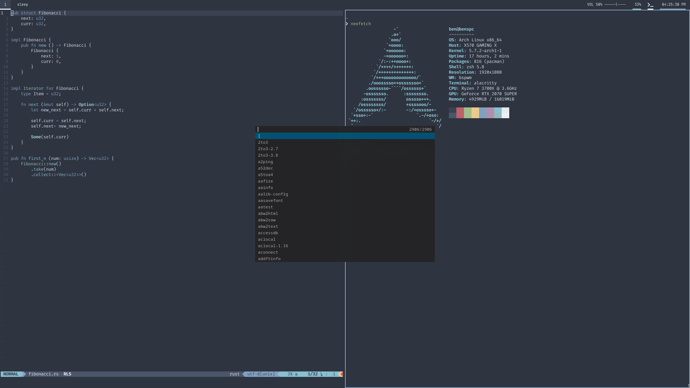

## Dotfiles

### Packages:
| Use            	| Thing                                                                                                       	|
|----------------	|-------------------------------------------------------------------------------------------------------------	|
| Window Manager 	| [BSPWM](https://github.com/baskerville/bspwm)                                                               	|
| Hotkeys        	| [SXHKD](https://github.com/baskerville/sxhkd)                                                               	|
| Terminal       	| [Alacritty](https://github.com/alacritty/alacritty)                                                         	|
| Editor         	| [Neovim](https://neovim.io)                                                                                 	|
| Shell          	| [Zsh](https://www.zsh.org) + [Oh My Zsh](https://ohmyz.sh)                                                  	|
| Notifications  	| [Dunst](https://dunst-project.org)                                                                          	|
| Theme          	| [Nord](https://nordtheme.com)                                                                               	|
| Bar            	| [Polybar](https://polybar.github.io)                                                                        	|
| Compositor     	| [Picom](https://github.com/yshui/picom)                                                                     	|
| Launcher       	| [Dmenu](https://tools.suckless.org/dmenu) + [Center Patch](https://tools.suckless.org/dmenu/patches/center) 	|
| Screenshots    	| [Maim](https://github.com/naelstrof/maim) / [Flameshot](https://flameshot.js.org)                           	|
| Audio          	| [PulseAudio](https://gitlab.freedesktop.org/pulseaudio/pulseaudio)                                          	|
### Installation
```bash
# add 'dot' as an alias
$ echo 'alias dot="/usr/bin/git --git-dir=$HOME/.dotfiles.git/ --work-tree=$HOME"' >> $HOME/.zshrc
# reload your zshrc
$ source ~/.zshrc
# add '.dotfiles.git' to gitignore
$ echo '.dotfiles.git' >> .gitignore
# clone this repo
$ git clone --bare git@github.com:Benricheson101/dotfiles.git $HOME/.dotfiles.git
# check for conflicts
$ dot checkout
# prevent untracked files from showing up in `dot status`
$ dot config --local status.showUntrackedFiles false
```
### Picture

